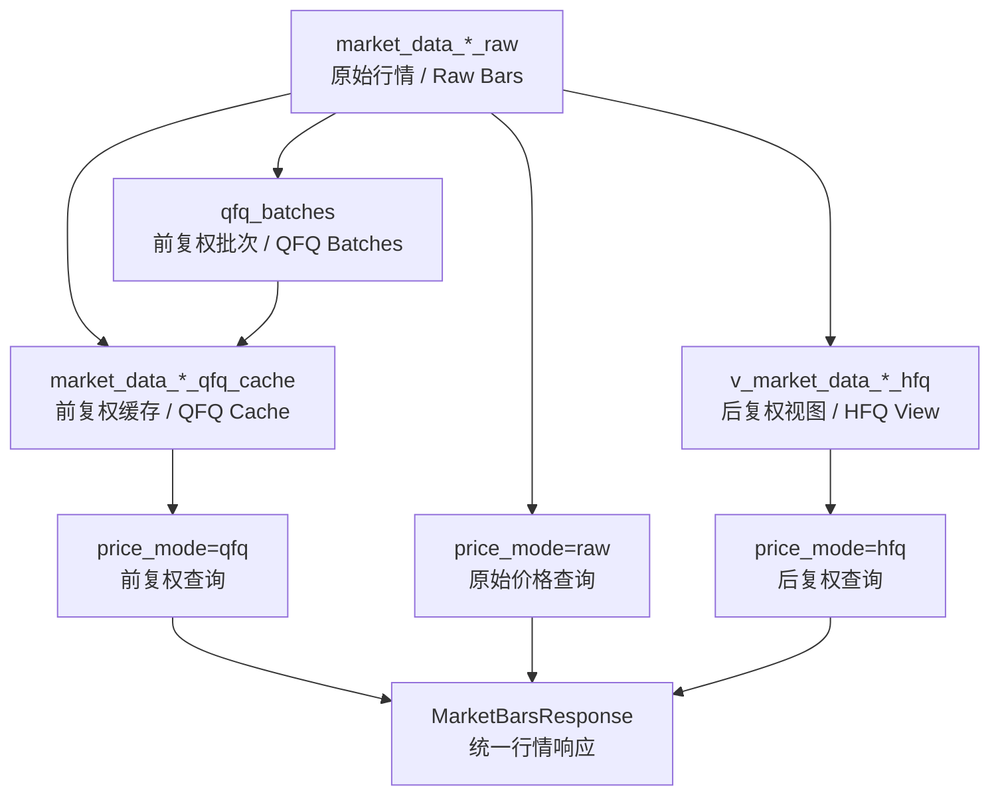

# quant_contracts 与 101 旧数据接入项目协议映射

> 目标：先解决字段命名和数据协议问题，再迁移代码。旧项目内部字段不强制重命名，统一通过 `quant_contracts` 暴露稳定契约。

---

## 1. 设计原则

- `quant_contracts` 对外使用稳定、业务语义清晰的字段。
- `quant_data_hub` 内部存储可以保留旧项目字段，减少 ClickHouse 大表改造成本。
- 字段映射集中放在 repository / service / adapter 层。
- 兼容旧项目 API，但新增接口优先遵循当前项目命名。
- 不在公共 schema 中暴露真实密钥、连接串、供应商 token。

---

## 2. 行情字段映射

| quant_contracts 字段 | 旧项目字段 | 说明 |
|---|---|---|
| `symbol` | `code` | 证券代码，例如 `000001.SZ` |
| `trade_date` | `date` | 日线交易日 |
| `trade_time` | `trade_time` | 分钟线时间 |
| `open_price` | `open` | 原始开盘价 |
| `high_price` | `high` | 原始最高价 |
| `low_price` | `low` | 原始最低价 |
| `close_price` | `close` | 原始收盘价 |
| `pre_close_price` | `pre_close` | 原始昨收价 |
| `change_value` | `change` | 涨跌额 |
| `pct_change` | `pct_chg` | 涨跌幅 |
| `volume` | `vol` | 成交量 |
| `turnover` | `amount` | 成交额 |
| `vwap` | `vwap` | 日线成交均价，分钟线可为空 |
| `adjustment_factor` | `adj_factor` / `qfq_factor` / `hfq_factor` | 当前 `price_mode` 下生效的复权因子 |
| `source_name` | `source_name` | 数据来源 |
| `created_at` | `created_at` | 入库或生成时间 |

---

## 3. 价格口径映射

旧项目已形成三套价格口径：

```text
raw: 原始价格
qfq: 前复权价格，依赖 batch_id / qfq_base_date
hfq: 后复权价格，通过 ClickHouse view 动态计算
```

建议在 `quant_contracts` 中定义：

```python
from enum import StrEnum


class PriceMode(StrEnum):
    RAW = "raw"
    QFQ = "qfq"
    HFQ = "hfq"
```

前复权查询必须显式提供：

```text
batch_id
```

`qfq_base_date` 由 `quant_data_hub` 根据 `batch_id` 从 `qfq_batches` 解析，并返回到 `MarketBarsResponse.meta.qfq_base_date`，供因子计算、验证和审计记录使用。

后复权查询不需要基准日：

```text
hfq_price = raw_price * adjustment_factor
```

级联查询关系：



---

## 4. 行情查询协议映射

旧项目请求：

```text
POST /api/v1/market/bars/query
```

旧请求模型：

```text
timeframe
codes
start
end
price_mode
dataset_code
batch_id
fields
limit
```

建议公共协议：

```python
from datetime import date, datetime
from typing import Literal

from pydantic import BaseModel, Field


Timeframe = Literal["1m", "5m", "1d"]


class MarketBarsQuery(BaseModel):
    timeframe: Timeframe
    symbols: list[str] = Field(min_length=1, max_length=500)
    start: date | datetime | str
    end: date | datetime | str
    price_mode: PriceMode = PriceMode.RAW
    dataset_code: str | None = None
    batch_id: str | None = None
    fields: list[str] | None = None
    limit: int = Field(default=10000, ge=1, le=100000)
```

兼容规则：

```text
symbols <-> codes
trade_date <-> date
turnover <-> amount
volume <-> vol
```

标准接口示例：

```json
{
  "timeframe": "1d",
  "symbols": ["000001.SZ"],
  "start": "2026-03-13",
  "end": "2026-03-13",
  "price_mode": "qfq",
  "batch_id": "qfq_20260313",
  "fields": ["symbol", "trade_date", "close_price", "volume", "adjustment_factor"]
}
```

旧接口兼容 payload：

```json
{
  "timeframe": "1d",
  "codes": ["000001.SZ"],
  "start": "2026-03-13",
  "end": "2026-03-13",
  "price_mode": "qfq",
  "batch_id": "qfq_20260313",
  "fields": ["code", "date", "close", "vol", "adj_factor"]
}
```

返回仍统一为 `MarketBarsResponse`，即对外使用 `symbol`、`trade_date`、`close_price`、`volume`、`adjustment_factor` 等标准字段。

---

## 5. qfq batch 协议映射

旧项目字段：

```text
batch_id
qfq_base_date
status
description
created_at
finished_at
```

建议公共模型：

```python
from datetime import date, datetime

from pydantic import BaseModel


class QfqBatch(BaseModel):
    batch_id: str
    qfq_base_date: date
    status: str
    description: str | None = None
    created_at: datetime | None = None
    finished_at: datetime | None = None
```

---

## 6. 任务与产物血缘映射

旧项目已有：

```text
task_runs
task_artifacts
```

适合迁移到当前方案，作为后续因子计算、回测、研究导出的公共血缘模型。

建议公共模型：

```text
TaskRun
TaskArtifact
ArtifactType
TaskStatus
```

核心字段：

```text
task_id
task_type
task_name
owner
status
input_params
output_summary
error_message
created_at
started_at
finished_at

artifact_id
artifact_type
bucket_name
object_key
uri
file_size_bytes
metadata
```

约束：

- 不在 `input_params` 和 `metadata` 中保存 token、密码、MinIO secret。
- SDK 只暴露预签名 URL，不暴露 MinIO 管理密钥。
- 不强制数据库外键，避免大规模任务写入被约束检查放大成本。

---

## 7. 推荐落地方式

第一步在 `packages/quant_contracts` 中实现：

```text
enums/price_mode.py
enums/timeframe.py
schemas/market_data.py
schemas/market_query.py
schemas/adjustment.py
schemas/task.py
```

第二步在 `services/quant_data_hub` 中实现兼容转换：

```text
legacy code/date/open/vol/amount
    ↓
quant_contracts symbol/trade_date/open_price/volume/turnover
```

第三步保留旧 API 一段时间：

```text
POST /api/v1/market/bars/query
```

新增接口可以采用当前项目命名：

```text
POST /api/v1/market-bars/query
```
